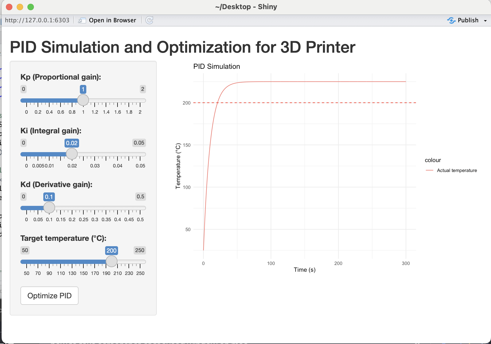

# PID Tuning for 3D Printer Temperature Control

This R Shiny application simulates and optimizes a PID controller for managing the temperature of a 3D printer's hotend or heated bed. By adjusting the proportional, integral, and derivative (PID) parameters, the app helps achieve stable and accurate temperature control, essential for high-quality prints.

## Features
- **Interactive Sliders**: Adjust PID parameters (Kp, Ki, Kd) and set the target temperature in real time.
- **Realistic Thermal Simulation**: Models heating and cooling dynamics, including thermal inertia and physical limits.
- **Optimization**: Automatically tune PID parameters using a genetic algorithm.
- **Visualization**: Real-time plots of temperature response vs. setpoint.

## Challenges and Obstacles
1. **Windup Prevention**: Preventing the integral term from causing runaway heating required robust anti-windup logic.
2. **Physical Realism**: Simulating realistic thermal dynamics, including heat transfer efficiency and cooling effects, was crucial for accuracy.
3. **Parameter Ranges**: Finding appropriate ranges for PID parameters to balance stability and responsiveness.
4. **Edge Cases**: Managing scenarios where temperature overshoots or fails to stabilize, which required careful calibration of penalties in the optimization algorithm.

## Why It Matters
3D printers rely on precise temperature control to ensure consistent extrusion and layer adhesion. This app not only helps tune PID controllers effectively but also provides a deeper understanding of how thermal systems behave.

---

Try the app to achieve a perfect balance between stability and responsiveness in your 3D printer's temperature control system!
